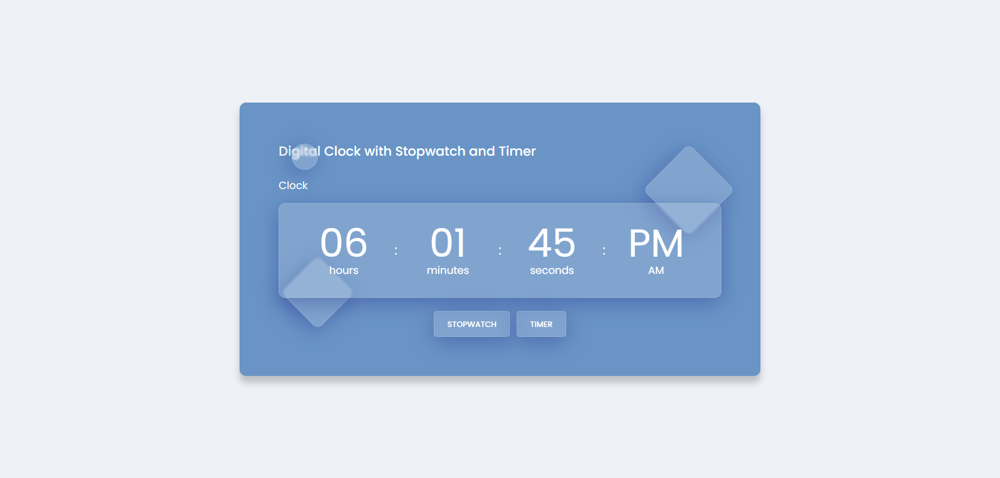

# ⏰ Digital Clock with Stopwatch & Timer

A beautiful, responsive **Digital Clock Web App** built using HTML, CSS, jQuery, and JavaScript. This project includes three major functionalities:
- 🕒 Real-time Clock
- ⏱️ Stopwatch with Lap Feature
- ⏲️ Countdown Timer with Alert

---

## 💡 Features

- Clean UI with blurred glassmorphism effect
- Responsive design for mobile and desktop
- Lap system for stopwatch
- Prompt-based timer input
- Smooth toggle between views (clock, stopwatch, timer)

---

## 🛠️ Tech Stack

- HTML5
- CSS3 (Glassmorphism Design)
- JavaScript (ES6)
- jQuery (for quick DOM manipulation)

---

## 🚀 Live Demo

👉 [Click here to view the project live](https://your-live-link.netlify.app)

---

## 🔗 GitHub Repository

📦 [View Source Code on GitHub](https://github.com/your-username/digital-clock-timer)

---

## 📸 Screenshots

---

## 🙋‍♂️ Made with ❤️ in India by [Pratik Kumar Saurav]
